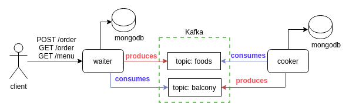

# saga-example
Projeto de exemplo para demonstrar o padrão de arquitetura [Saga](https://microservices.io/patterns/data/saga.html).

No padrão Saga temos que para um determinado microsserviço as informações de completude de uma transação é dividida entre seus microsserviços servidores. Desta forma para definir, por exemplo, o estado de uma transação é necessário aguardar o processamento dos microsserviços servidores. 

## Cenário - Padaria

Para exemplificar o padrão foi escolhido o domínio de uma padaria. Neste domínio temos três personas sendo [Garçons (waiter)](./waiter), [Cozinheiros (cooker)](./cooker) e [Barmen (bartender)](./bartender).
Neste cenário, os garçons respondem quais são os itens do menu, realizam os pedidos e verificam se os pedidos estão prontos. Os cozinheiros e barmen recebem os pedidos e os produzem, aguardando o tempo necessário para preparo de cada item.
Uma vez que cada item do pedido foi enviado para o preparo, é possível perguntar ao garçom se o pedido já está pronto. Caso esteja, o estado do pedido será pronto, caso contrário, pendente. 

## Arquitetura

Abaixo segue a arquitura implementada.

Conforme pode ser visto, foram criados diferentes microsserviços para cada persona. Optamos por utilizar o [Apache Kafka](https://kafka.apache.org/) para gerir as mensagens entre os microsserviços e o [MongoDd](https://www.mongodb.com/) como banco de dados. 

Todos os microsserviços foram implementados em [Python](https://www.python.org/). Porém, como apenas o microsserviço [waiter](./waiter) possui interface com o usuário, ele possui uma interface web construida utilizando [Flask](https://flask.palletsprojects.com/en/1.1.x/). Já os demais microsserviços ([cooker](./cooker) e [bartender](./bartender)) são apenas consumidores, logo não possuindo interface web.

## Rodando a stack

Para construir as dependências necessárias para os microsserviços foi contruido um [docker-compose.yml](./docker-compose.yml). Ele cria os containers [Docker](https://www.docker.com/) das aplicações, o Kafka e suas dependências ([Zookeeper](https://kafka.apache.org/documentation/#zk)) além dos bancos de dados dos microsserviços. 

## Testando a stack

Visando simplificar o teste, é disponibilizado uma [postman collection](./postman/saga-example.postman_collection.json).
Para confirmar o comportamento do padrão saga, execute uma chamada da API POST /order e verifique na API GET /order a mudança do estado (campo status) dos itens. 